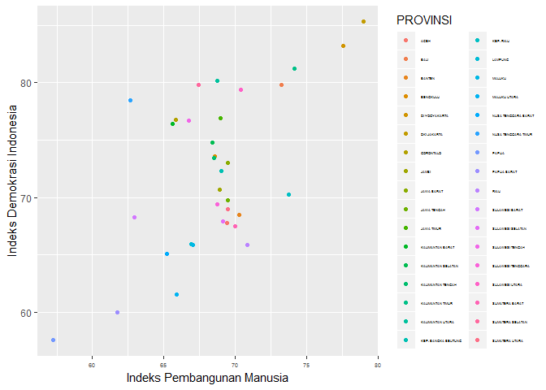
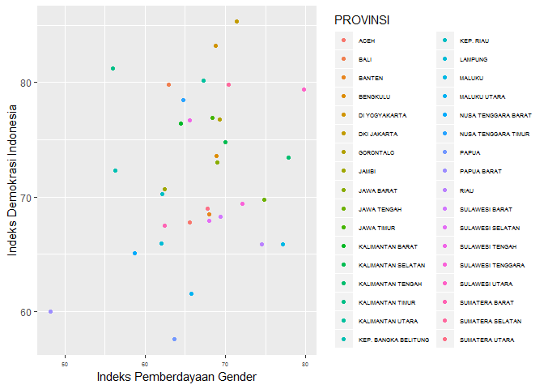
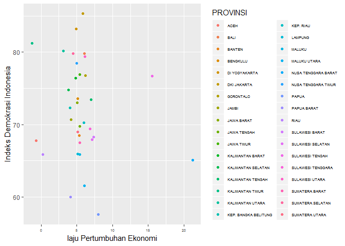
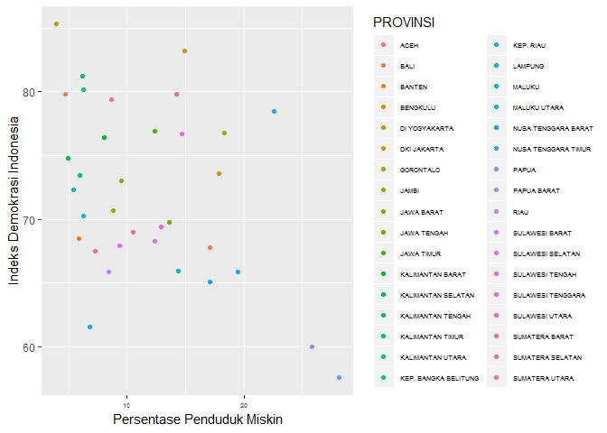
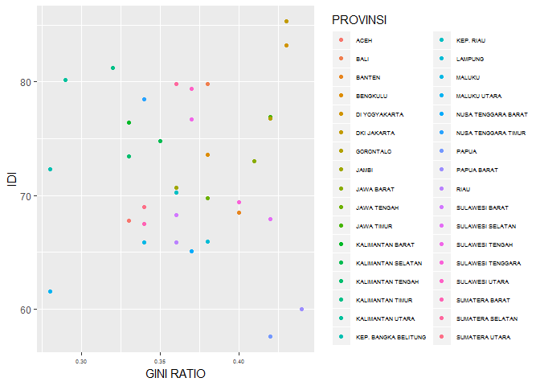
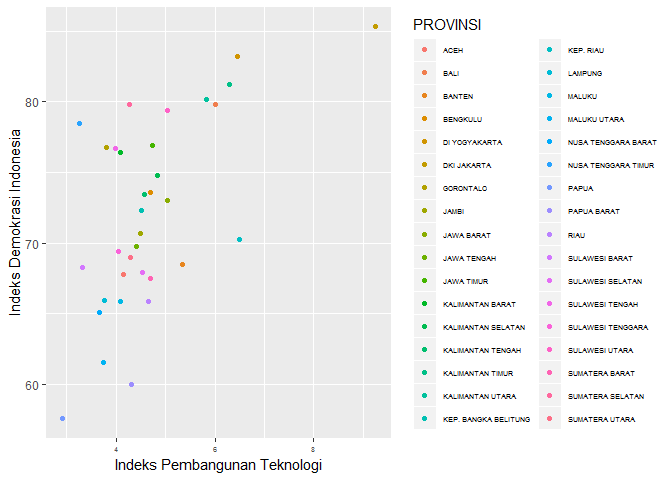
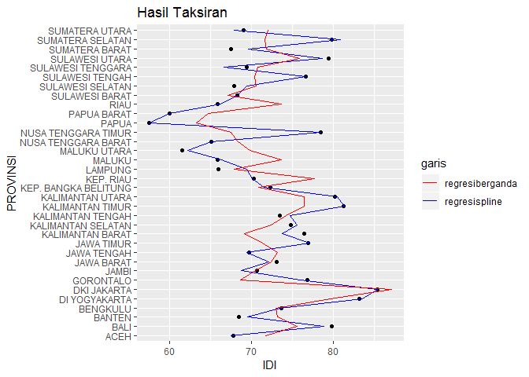

contoh
================
Risky Frasetio Wahyu Pratama
December 27, 2018

Running Nonparametric Spline Truncated
======================================

data
----

data yang digunakan yakni data Indeks Demokrasi Indonesia bersumber dari BPS.

``` r
library(readxl)
dat=read_excel(choose.files())
dat=as.data.frame(dat)
dat
```

    ##                PROVINSI Y_IDI X1_IPM X2_IDG X3_LPE X4_PPM X5_GR X6_IPTIK
    ## 1                  ACEH 67.78  69.45  65.57  -0.72  17.08  0.33     4.14
    ## 2        SUMATERA UTARA 69.01  69.51  67.81   5.10  10.53  0.34     4.29
    ## 3        SUMATERA BARAT 67.46  69.98  62.42   5.41   7.31  0.34     4.69
    ## 4                  RIAU 65.83  70.84  74.59   0.22   8.42  0.36     4.65
    ## 5                 JAMBI 70.68  68.89  62.43   4.21   8.86  0.36     4.50
    ## 6      SUMATERA SELATAN 79.81  67.46  70.36   4.50  14.25  0.36     4.27
    ## 7              BENGKULU 73.60  68.59  68.86   5.14  17.88  0.38     4.70
    ## 8               LAMPUNG 65.95  66.95  62.01   5.13  14.35  0.38     3.76
    ## 9  KEP. BANGKA BELITUNG 72.31  69.05  56.29   4.08   5.40  0.28     4.51
    ## 10            KEP. RIAU 70.26  73.75  62.15   6.02   6.24  0.36     6.49
    ## 11          DKI JAKARTA 85.32  78.99  71.41   5.88   3.93  0.43     9.25
    ## 12           JAWA BARAT 73.04  69.50  69.02   5.03   9.53  0.41     5.03
    ## 13          JAWA TENGAH 69.75  69.49  74.80   5.44  13.58  0.38     4.41
    ## 14        DI YOGYAKARTA 83.19  77.59  68.75   4.94  14.91  0.43     6.45
    ## 15           JAWA TIMUR 76.90  68.95  68.41   5.44  12.34  0.42     4.74
    ## 16               BANTEN 68.46  70.27  67.94   5.37   5.90  0.40     5.35
    ## 17                 BALI 79.83  73.27  62.99   6.04   4.74  0.38     6.01
    ## 18  NUSA TENGGARA BARAT 65.08  65.19  58.69  21.24  17.10  0.37     3.67
    ## 19  NUSA TENGGARA TIMUR 78.47  62.67  64.75   5.02  22.61  0.34     3.26
    ## 20     KALIMANTAN BARAT 76.40  65.59  64.44   4.81   8.03  0.33     4.08
    ## 21    KALIMANTAN TENGAH 73.46  68.53  77.87   7.01   5.94  0.33     4.57
    ## 22   KALIMANTAN SELATAN 74.76  68.38  70.05   3.84   4.99  0.35     4.84
    ## 23     KALIMANTAN TIMUR 81.24  74.17  55.96  -1.28   6.23  0.32     6.30
    ## 24     KALIMANTAN UTARA 80.16  68.76  67.31   3.13   6.24  0.29     5.83
    ## 25       SULAWESI UTARA 79.40  70.39  79.82   6.12   8.65  0.37     5.04
    ## 26      SULAWESI TENGAH 76.67  66.76  65.57  15.56  14.66  0.37     3.98
    ## 27     SULAWESI SELATAN 67.90  69.15  67.98   7.15   9.39  0.42     4.53
    ## 28    SULAWESI TENGGARA 69.44  68.75  72.14   6.88  12.90  0.40     4.04
    ## 29            GORONTALO 76.77  65.86  69.26   6.23  18.32  0.42     3.81
    ## 30       SULAWESI BARAT 68.25  62.96  69.40   7.37  12.40  0.36     3.33
    ## 31               MALUKU 65.90  67.05  77.15   5.44  19.51  0.34     4.09
    ## 32         MALUKU UTARA 61.52  65.91  65.74   6.10   6.84  0.28     3.75
    ## 33          PAPUA BARAT 59.97  61.73  48.19   4.10  25.82  0.44     4.32
    ## 34                PAPUA 57.55  57.25  63.69   7.97  28.17  0.42     2.91

pola hubungan antara masing-masing prediktor terhadap respon dapat dilihat sebagai berikut

``` r
library(ggplot2)
qplot(X1_IPM,Y_IDI,data=dat,colour=PROVINSI,xlab = "Indeks Pembangunan Manusia",ylab="Indeks Demokrasi Indonesia") + theme(legend.text=element_text(size = 3),axis.text.x = element_text(size=5))
```



``` r
qplot(X2_IDG,Y_IDI,data=dat,colour=PROVINSI,xlab = "Indeks Pemberdayaan Gender",ylab="Indeks Demokrasi Indonesia") + theme(legend.text=element_text(size = 5),axis.text.x = element_text(size=5))
```



``` r
qplot(X3_LPE,Y_IDI,data=dat,colour=PROVINSI,xlab = "laju Pertumbuhan Ekonomi",ylab="Indeks Demokrasi Indonesia") + theme(legend.text=element_text(size = 5),axis.text.x = element_text(size=5))
```



``` r
qplot(X4_PPM,Y_IDI,data=dat,colour=PROVINSI,xlab = "Persentase Penduduk Miskin",ylab="Indeks Demokrasi Indonesia") + theme(legend.text=element_text(size = 5),axis.text.x = element_text(size=5))
```



``` r
qplot(X5_GR,Y_IDI,data=dat,colour=PROVINSI,xlab = "GINI RATIO",ylab="IDI") + theme(legend.text=element_text(size = 5),axis.text.x = element_text(size=5))
```



``` r
qplot(X6_IPTIK,Y_IDI,data=dat,colour=PROVINSI,xlab = "Indeks Pembangunan Teknologi",ylab="Indeks Demokrasi Indonesia") + theme(legend.text=element_text(size = 5),axis.text.x = element_text(size=5))
```



jika dimodelkan dengan regresi linier berganda
----------------------------------------------

``` r
regresi.par=lm(Y_IDI~.,data=dat[,-1])
summary(regresi.par)
```

    ## 
    ## Call:
    ## lm(formula = Y_IDI ~ ., data = dat[, -1])
    ## 
    ## Residuals:
    ##    Min     1Q Median     3Q    Max 
    ## -8.312 -3.792 -0.266  3.668 10.934 
    ## 
    ## Coefficients:
    ##              Estimate Std. Error t value Pr(>|t|)
    ## (Intercept)  27.26535   31.80553   0.857    0.399
    ## X1_IPM        0.37358    0.54409   0.687    0.498
    ## X2_IDG        0.19876    0.16342   1.216    0.234
    ## X3_LPE        0.08947    0.27511   0.325    0.748
    ## X4_PPM        0.13508    0.25920   0.521    0.607
    ## X5_GR       -25.64988   30.39934  -0.844    0.406
    ## X6_IPTIK      2.82403    1.81812   1.553    0.132
    ## 
    ## Residual standard error: 5.669 on 27 degrees of freedom
    ## Multiple R-squared:  0.4233, Adjusted R-squared:  0.2951 
    ## F-statistic: 3.303 on 6 and 27 DF,  p-value: 0.01438

jika dimodelkan dengan regresi nonparametrik spline truncated linier
--------------------------------------------------------------------

``` r
source('D:/kampus/kerja/spline/splinetruncated.R')
x=dat[,-c(1,2)]
y=dat[,2]
model=spline.truncated.linier.multivariabel(x,y,b=30,taraf.alpha = 0.05)
```

    ## ================================================= 
    ## satu knot optimum untuk masing-masing variabel 
    ## ================================================= 
    ##  
    ## GCV minimum =  33.46436 
    ##  
    ## knot optimum variabel ke- 1 
    ## 77.49069 
    ##  
    ## knot optimum variabel ke- 2 
    ## 77.63862 
    ##  
    ## knot optimum variabel ke- 3 
    ## 19.6869 
    ##  
    ## knot optimum variabel ke- 4 
    ## 26.49828 
    ##  
    ## knot optimum variabel ke- 5 
    ## 0.4289655 
    ##  
    ## knot optimum variabel ke- 6 
    ## 8.812759 
    ##  
    ## ================================================= 
    ## dua knot optimum untuk masing-masing variabel 
    ## ================================================= 
    ##  
    ## GCV minimum =  34.3934 
    ##  
    ## knot optimum variabel ke- 1 
    ## 77.49069 78.24034 
    ##  
    ## knot optimum variabel ke- 2 
    ## 77.63862 78.72931 
    ##  
    ## knot optimum variabel ke- 3 
    ## 19.6869 20.46345 
    ##  
    ## knot optimum variabel ke- 4 
    ## 26.49828 27.33414 
    ##  
    ## knot optimum variabel ke- 5 
    ## 0.4289655 0.4344828 
    ##  
    ## knot optimum variabel ke- 6 
    ## 8.812759 9.031379 
    ##  
    ## ================================================= 
    ## tiga knot optimum untuk masing-masing variabel 
    ## ================================================= 
    ##  
    ## GCV minimum =  20.30692 
    ##  
    ## knot optimum variabel ke- 1 
    ## 59.49897 69.24448 71.49345 
    ##  
    ## knot optimum variabel ke- 2 
    ## 51.46207 65.64103 68.9131 
    ##  
    ## knot optimum variabel ke- 3 
    ## 1.049655 11.14483 13.47448 
    ##  
    ## knot optimum variabel ke- 4 
    ## 6.437586 17.30379 19.81138 
    ##  
    ## knot optimum variabel ke- 5 
    ## 0.2965517 0.3682759 0.3848276 
    ##  
    ## knot optimum variabel ke- 6 
    ## 3.565862 6.407931 7.063793 
    ##  
    ## ============================================== 
    ## hasil kombinasi knot optimum dan GCV minimum 
    ## ============================================== 
    ## GCV minimum =  20.30692 
    ##  
    ## knot optimum 
    ## knot optimum variabel ke- 1 
    ## 59.49897 69.24448 71.49345 
    ##  
    ## knot optimum variabel ke- 2 
    ## 51.46207 65.64103 68.9131 
    ##  
    ## knot optimum variabel ke- 3 
    ## 1.049655 11.14483 13.47448 
    ##  
    ## knot optimum variabel ke- 4 
    ## 6.437586 17.30379 19.81138 
    ##  
    ## knot optimum variabel ke- 5 
    ## 0.2965517 0.3682759 0.3848276 
    ##  
    ## knot optimum variabel ke- 6 
    ## 3.565862 6.407931 7.063793 
    ##  
    ##  
    ## ===================================================================================================================== 
    ## tabel anava 
    ## ===================================================================================================================== 
    ## Sumber         db          SS            MS               Fhit               P-value         keputusan 
    ## ===================================================================================================================== 
    ## Regresi       24       1456.341       60.6809         11.2887    0.000355457800504359          tolak Hnol 
    ## Error         9       48.378       5.3754 
    ## Total         33       1504.719 
    ## ===================================================================================================================== 
    ##  
    ##  
    ## ===================================================================================================================== 
    ## parameter beta dan uji individu 
    ## ===================================================================================================================== 
    ##            beta              standar error       t hitung            p-value                  keputusan 
    ## ===================================================================================================================== 
    ## beta 0   -4140.472              540.7177          -7.657364            8.148115e-09                tolak Hnol 
    ## beta 1   34.59723              4.888311          7.077543            4.209535e-08                tolak Hnol 
    ## beta 2   -38.32429              5.099742          -7.514947            1.215564e-08                tolak Hnol 
    ## beta 3   4.581955              1.993045          2.298972            0.02797486                tolak Hnol 
    ## beta 4   -3.331311              2.677733          -1.244079            0.222235                gagal tolak Hnol 
    ## beta 5   35.3524              4.583268          7.713362            6.966623e-09                tolak Hnol 
    ## beta 6   -36.43669              4.724308          -7.712598            6.981512e-09                tolak Hnol 
    ## beta 7   1.937791              0.8277002          2.341175            0.0254131                tolak Hnol 
    ## beta 8   -0.4676441              0.8546911          -0.5471498            0.5879572                gagal tolak Hnol 
    ## beta 9   3.064272              1.954977          1.567421            0.1265566                gagal tolak Hnol 
    ## beta 10   -2.230817              2.331357          -0.9568749            0.3455884                gagal tolak Hnol 
    ## beta 11   1.18614              2.875604          0.412484            0.6826523                gagal tolak Hnol 
    ## beta 12   -6.470264              2.877993          -2.248186            0.03136471                tolak Hnol 
    ## beta 13   -3.48952              1.363135          -2.559922            0.01523504                tolak Hnol 
    ## beta 14   5.286233              1.511032          3.498426            0.001361279                tolak Hnol 
    ## beta 15   -12.45217              2.071126          -6.012271            9.304987e-07                tolak Hnol 
    ## beta 16   23.44727              3.665937          6.395982            3.02225e-07                tolak Hnol 
    ## beta 17   316.9262              236.1929          1.341811            0.1888178                gagal tolak Hnol 
    ## beta 18   -359.9151              295.0186          -1.219974            0.2311219                gagal tolak Hnol 
    ## beta 19   -616.1538              214.196          -2.876589            0.006993593                tolak Hnol 
    ## beta 20   962.0903              226.2233          4.252834            0.0001632744                tolak Hnol 
    ## beta 21   80.54589              18.93965          4.252764            0.0001633071                tolak Hnol 
    ## beta 22   -67.62468              18.64734          -3.626506            0.0009579066                tolak Hnol 
    ## beta 23   -213.3292              47.4414          -4.496688            8.060428e-05                tolak Hnol 
    ## beta 24   261.1814              60.40178          4.324069            0.0001329532                tolak Hnol 
    ## ===================================================================================================================== 
    ##  
    ## R square = 96.7849 
    ##  
    ##  
    ## ===================================================================================================================== 
    ## Uji kolmogorov-smirnov untuk kenormalan residual  
    ## ===================================================================================================================== 
    ## D              P-value              keputusan 
    ## ===================================================================================================================== 
    ## 0.1386613           0.4876049          residual berdistribusi normal 
    ## ===================================================================================================================== 
    ##  
    ##  
    ##  
    ## ===================================================================================================================== 
    ## uji Gleyjser 
    ## ===================================================================================================================== 
    ## Sumber         db          SS             MS             Fhit              P-value               keputusan 
    ## ===================================================================================================================== 
    ## Regresi       24        22.784        0.9493        2.5716        0.071259664543085        gagal tolak Hnol 
    ## Error         9        3.322        0.3692 
    ## Total         33        26.106 
    ## ===================================================================================================================== 
    ##  
    ##  
    ## ===================================================================================================================== 
    ## uji Durbin Watson  
    ## ===================================================================================================================== 
    ## DW             P-value           keputusan 
    ## ===================================================================================================================== 
    ## 2.506165           0.708          gagal tolak Hnol 
    ## =====================================================================================================================

b adalah banyaknya titik yang dicobakan akan dalam mencari knot optimal pada setiap variabel. masing-masing variabel akan memiliki b titik yang akan dicobakan dalam mencari satu knot optimal, 2 knot optimal, 3 knot optimal maupun kombinasi dari satu knot, dua knot dan 3 knot. Berdasarkan hasil terzebut diperoleh knot optimum yakni 4 knot untuk masing-masing variabel dengan nilai gcv 20,30692.

``` r
dat$ytopispline=model$ytopi
dat$ytopiregberganda=regresi.par$fitted.values
dat
```

    ##                PROVINSI Y_IDI X1_IPM X2_IDG X3_LPE X4_PPM X5_GR X6_IPTIK
    ## 1                  ACEH 67.78  69.45  65.57  -0.72  17.08  0.33     4.14
    ## 2        SUMATERA UTARA 69.01  69.51  67.81   5.10  10.53  0.34     4.29
    ## 3        SUMATERA BARAT 67.46  69.98  62.42   5.41   7.31  0.34     4.69
    ## 4                  RIAU 65.83  70.84  74.59   0.22   8.42  0.36     4.65
    ## 5                 JAMBI 70.68  68.89  62.43   4.21   8.86  0.36     4.50
    ## 6      SUMATERA SELATAN 79.81  67.46  70.36   4.50  14.25  0.36     4.27
    ## 7              BENGKULU 73.60  68.59  68.86   5.14  17.88  0.38     4.70
    ## 8               LAMPUNG 65.95  66.95  62.01   5.13  14.35  0.38     3.76
    ## 9  KEP. BANGKA BELITUNG 72.31  69.05  56.29   4.08   5.40  0.28     4.51
    ## 10            KEP. RIAU 70.26  73.75  62.15   6.02   6.24  0.36     6.49
    ## 11          DKI JAKARTA 85.32  78.99  71.41   5.88   3.93  0.43     9.25
    ## 12           JAWA BARAT 73.04  69.50  69.02   5.03   9.53  0.41     5.03
    ## 13          JAWA TENGAH 69.75  69.49  74.80   5.44  13.58  0.38     4.41
    ## 14        DI YOGYAKARTA 83.19  77.59  68.75   4.94  14.91  0.43     6.45
    ## 15           JAWA TIMUR 76.90  68.95  68.41   5.44  12.34  0.42     4.74
    ## 16               BANTEN 68.46  70.27  67.94   5.37   5.90  0.40     5.35
    ## 17                 BALI 79.83  73.27  62.99   6.04   4.74  0.38     6.01
    ## 18  NUSA TENGGARA BARAT 65.08  65.19  58.69  21.24  17.10  0.37     3.67
    ## 19  NUSA TENGGARA TIMUR 78.47  62.67  64.75   5.02  22.61  0.34     3.26
    ## 20     KALIMANTAN BARAT 76.40  65.59  64.44   4.81   8.03  0.33     4.08
    ## 21    KALIMANTAN TENGAH 73.46  68.53  77.87   7.01   5.94  0.33     4.57
    ## 22   KALIMANTAN SELATAN 74.76  68.38  70.05   3.84   4.99  0.35     4.84
    ## 23     KALIMANTAN TIMUR 81.24  74.17  55.96  -1.28   6.23  0.32     6.30
    ## 24     KALIMANTAN UTARA 80.16  68.76  67.31   3.13   6.24  0.29     5.83
    ## 25       SULAWESI UTARA 79.40  70.39  79.82   6.12   8.65  0.37     5.04
    ## 26      SULAWESI TENGAH 76.67  66.76  65.57  15.56  14.66  0.37     3.98
    ## 27     SULAWESI SELATAN 67.90  69.15  67.98   7.15   9.39  0.42     4.53
    ## 28    SULAWESI TENGGARA 69.44  68.75  72.14   6.88  12.90  0.40     4.04
    ## 29            GORONTALO 76.77  65.86  69.26   6.23  18.32  0.42     3.81
    ## 30       SULAWESI BARAT 68.25  62.96  69.40   7.37  12.40  0.36     3.33
    ## 31               MALUKU 65.90  67.05  77.15   5.44  19.51  0.34     4.09
    ## 32         MALUKU UTARA 61.52  65.91  65.74   6.10   6.84  0.28     3.75
    ## 33          PAPUA BARAT 59.97  61.73  48.19   4.10  25.82  0.44     4.32
    ## 34                PAPUA 57.55  57.25  63.69   7.97  28.17  0.42     2.91
    ##    ytopispline ytopiregberganda
    ## 1     67.52362         71.71266
    ## 2     67.88741         71.98331
    ## 3     69.57197         71.80998
    ## 4     66.23913         73.60975
    ## 5     68.72347         70.45722
    ## 6     80.87660         71.60365
    ## 7     73.41433         72.97661
    ## 8     69.39476         67.87013
    ## 9     71.55573         70.89784
    ## 10    70.09152         77.64501
    ## 11    85.32000         87.11730
    ## 12    72.06869         72.37301
    ## 13    69.45379         73.12045
    ## 14    83.51867         79.55743
    ## 15    77.14996         71.38710
    ## 16    69.56359         73.14627
    ## 17    78.84222         75.56327
    ## 18    65.08000         68.36792
    ## 19    78.47000         67.53573
    ## 20    73.71490         69.14887
    ## 21    74.74410         74.21476
    ## 22    75.58770         72.44200
    ## 23    81.28905         76.40657
    ## 24    80.42410         76.47949
    ## 25    78.60094         75.88494
    ## 26    76.67000         70.35954
    ## 27    69.44899         70.53780
    ## 28    66.67243         70.79440
    ## 29    75.96189         68.65381
    ## 30    68.25000         67.08402
    ## 31    66.32072         73.59934
    ## 32    62.16973         69.83203
    ## 33    59.97000         64.67297
    ## 34    57.55000         63.27484

``` r
ggplot(dat,aes(x=PROVINSI,y=Y_IDI))+geom_point()+geom_line(aes(x=PROVINSI,y=ytopispline,group=1,colour="regresispline"))+geom_line(aes(x=PROVINSI,y=ytopiregberganda,group=1,colour="regresiberganda"))+ggtitle("Hasil Taksiran")+ylab("IDI")+coord_flip()+scale_colour_manual(name="garis",values=c(regresispline="blue",regresiberganda="red"))
```


